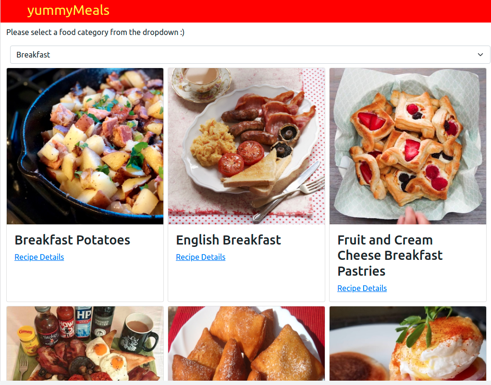
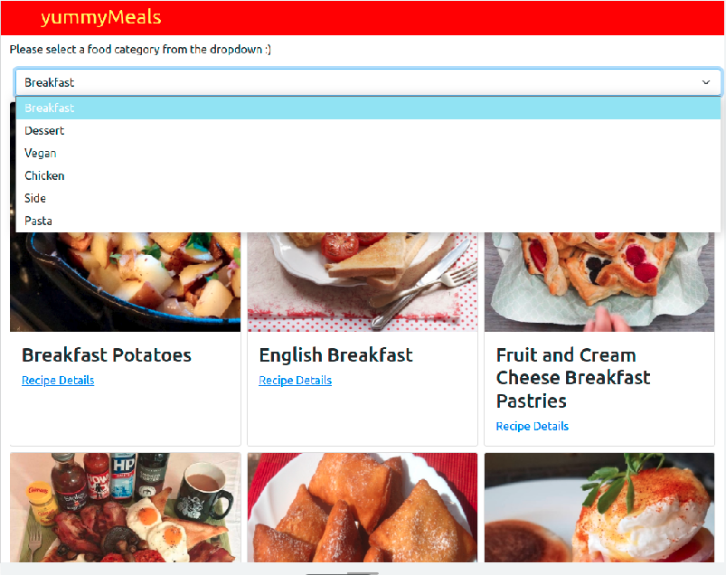
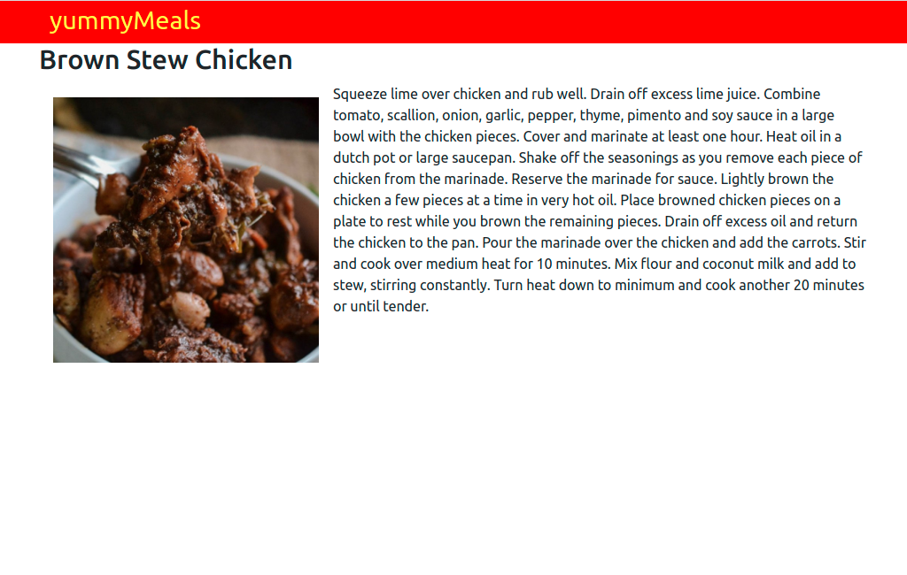

# yummymeals


> A React-Redux yummymeals capstone application that comsumes theMealDB APi and returns categorized information that can easily be sorted through and filtered.
It provides a catalogue of a variety of meals; Breakfast, Chicken, Vegan, Dessert.

It uses Redux for a single source of truth while doing state management. The redux store keeps the data retrieved from the API.

All pages have a single rote within the SPA.

## Screenshot



## Live Demo
[Netlify link](https://cranky-meninsky-ed52f3.netlify.app/)

## Built With

- HTML5, CSS3, & JavaScript
- React
- Redux

## Instructions
To get a local copy up and running follow these simple example steps.

### Prerequisites
- Gitbash installed to navigate between the branches.
- A preferred text editor for example VS Code.
- A browser such as Google Chrome

## Install
Clone this [GitHub Repo](https://github.com/KabohaJeanMark/yummymeals/) to your computer on yourFolder by typing these commands in the terminal or download as a Zip file and extract.
```
$ mkdir yourFolder
$ cd yourFolder
$ git clone https://github.com/KabohaJeanMark/yummymeals/

```
## How to Use
You can easily filter meals depending on categories and add click on their recipes to view more of their details.



By clicking on the recipe, you link to a details page with an explanation of how to create that meal.



## Available Scripts

In the project directory, you can run:

### `npm start`

Runs the app in the development mode.\
Open [http://localhost:3000](http://localhost:3000) to view it in the browser.

The page will reload if you make edits.\
You will also see any lint errors in the console.

## Author

👤 **Kaboha Jean Mark**

- GitHub: [@KabohaJeanMark](https://github.com/KabohaJeanMark)
- Twitter: [@jean_quintus](https://twitter.com/jean_quintus)
- LinkedIn: [Jean Mark Kaboha](https://www.linkedin.com/in/jean-mark-kaboha-software-engineer/)


## 🤝 Contributing

Contributions, issues, and feature requests are welcome!

Feel free to check the [issues page](https://github.com/KabohaJeanMark/yummymeals/issues).

## Show your support

Give a ⭐️ if you like this project!

## Acknowledgments

- Hat tip to Microverse for the README template, instructions and tutoring for this Capstone project.

## 📝 License

This project is [MIT](./LICENSE) licensed.
